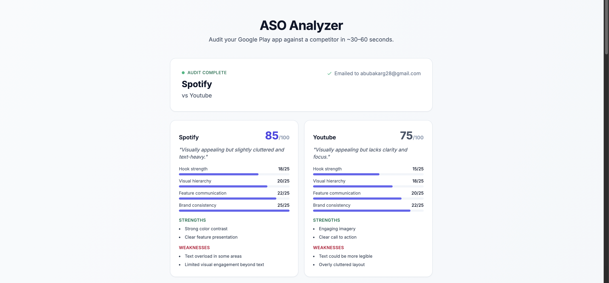

# ASO Analyzer

> Automated App Store Optimization audits for Google Play apps. Drop in your app name, your competitor's, and a few screenshots — get a prioritized action plan in your inbox in under a minute.

🔗 **[Try it live →](https://muhammad-abu-bakar.github.io/aso-analyzer/)**



---

## What it does

ASO consultants charge thousands for what is, frankly, a checklist run against your store listing plus some screenshot critique. This tool automates the 80% of that work that's mechanical:

- **Scrapes your Google Play listing** for title, description, ratings, and screenshots
- **Compares against a competitor** of your choice in the same category
- **Scores screenshots with vision AI** across hook strength, visual hierarchy, feature communication, and brand consistency
- **Generates a prioritized audit** with quick wins (this week), medium-term moves (this month), and strategic plays (this quarter)
- **Emails the full report** plus shows it in the browser

The output is a real, opinionated audit — not a generic ASO checklist.

## How it works

```
[ Web form ] → [ n8n webhook ] → [ Jina (scrape) ]
                      ↓
                 [ GPT-4o-mini ] ← analyzes title/description/keywords
                      ↓
              [ GPT-4o-mini Vision ] ← scores screenshots
                      ↓
            [ Synthesizes audit report ]
                      ↓
       [ Google Sheets log ]   [ Gmail send ]   [ HTTP response ]
```

The whole flow is a single n8n workflow: form input → multipart upload → branching logic for "did we find the app?" / "do screenshots match?" → analysis pipeline → response. Errors at each branch return structured JSON with codes the frontend handles gracefully.

## Tech stack

- **Backend orchestration:** [n8n](https://n8n.io/) (cloud, free tier)
- **Scraping:** [Jina Reader](https://jina.ai/reader/) for Google Play listings
- **LLM analysis:** OpenAI `gpt-4o-mini` (text + vision)
- **Storage:** Google Sheets for audit logs
- **Email:** Gmail node
- **Frontend:** Vanilla HTML/JS + Tailwind via CDN, deployed on GitHub Pages
- **API:** multipart/form-data webhook, structured JSON responses with error codes

## Repo structure

```
.
├── index.html              # The web frontend (single file, no build step)
├── workflows/
│   └── aso-analyzer.json   # Exported n8n workflow definition
├── docs/
│   └── screenshot.png      # README screenshot
└── README.md
```

## Running it yourself

The frontend is just a static HTML file — host anywhere or open locally.

The backend requires:
1. An n8n instance (cloud or self-hosted)
2. Imported workflow from `workflows/aso-analyzer.json`
3. Credentials configured for: OpenAI, Google Sheets, Gmail
4. Active webhook URL pasted into the `WEBHOOK_URL` constant in `index.html`

## API contract

`POST /webhook/aso-analyze-webhook`
**Content-Type:** `multipart/form-data`

**Fields:**

| Field | Type | Notes |
|---|---|---|
| `appName` | text | Your Google Play app name |
| `category` | text | e.g. "Education", "Photography" |
| `competitor` | text | Competitor app name |
| `email` | text | Where to send the report |
| `Your_App_Screenshots` | file (multi) | 2+ images |
| `Competitor_App_Screenshots` | file (multi) | 2+ images |

**Success response (200):**
```json
{
  "status": "success",
  "appName": "Marcus Chen Photography",
  "competitor": "ProCam",
  "email": "marcus@example.com",
  "audit_report": "...",
  "your_app_visual": "{...JSON-encoded scores...}",
  "competitor_visual": "{...JSON-encoded scores...}",
  "email_sent": true,
  "email_id": "..."
}
```

**Error responses:**
- `404` with `code: "app_not_found"` — couldn't locate the app on Google Play
- `422` with `code: "screenshot_mismatch"` — uploaded screenshots don't match the named app

## Known limitations

- **Reviews data is shallow.** Jina scrapes the listing page but doesn't capture user reviews. Replacing this with a proper reviews API is on the roadmap.
- **Keyword volumes are AI-guessed, not measured.** GPT pattern-matches "this looks like a high-volume keyword" rather than pulling real search volume data. Needs an AppFollow / App Annie integration.
- **Brand bias in vision scoring.** When the model sees a known brand, it tends to score more generously. The fix (already prototyped) is anonymized "App A vs App B" prompting.

## What's next

- [ ] Reviews scraper (separate API)
- [ ] Real keyword research integration
- [ ] Anonymized brand prompts in vision scoring
- [ ] Error sheet logging + metrics dashboard
- [ ] Prompt versioning for analysis quality tracking

## License

MIT
